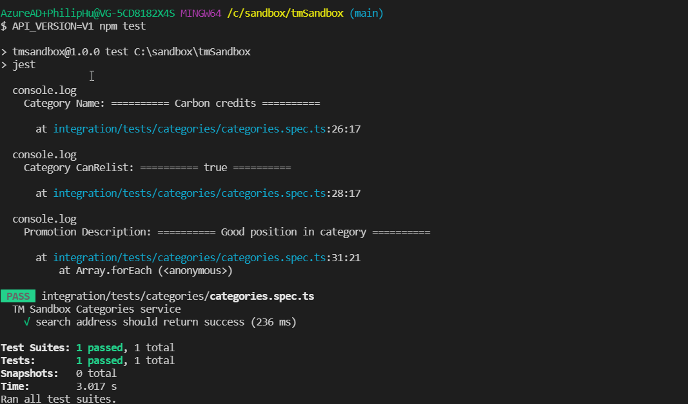

# tmSandbox Automation

These are tests for TM Sandbox. It runs on node and uses [axios](https://axios-http.com/) as the http client and [jest](https://jestjs.io/) for the test.

## Setup

To set up the project, install the npm packages first by installing 
[NodeJS LTS](https://nodejs.org/en/)

then open the projects via IDE (for example VSCode ) then running on bash or shell from the terminal

```shell
npm ci
```

## Test
the test need to set an environment variable called API_VERSION the default value is V1

```shell
API_VERSION=V1 npm test
```

or you can add the value into .env file on the root of this folder

**to run the test**
```shell
npm test
```

